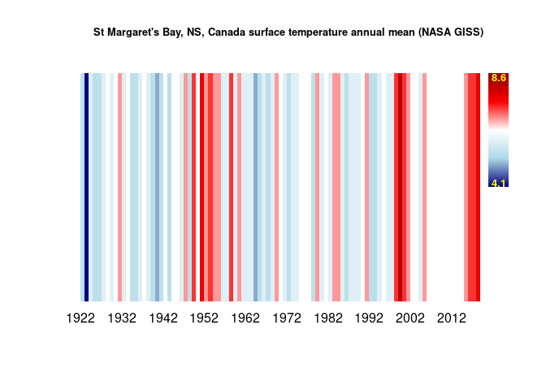
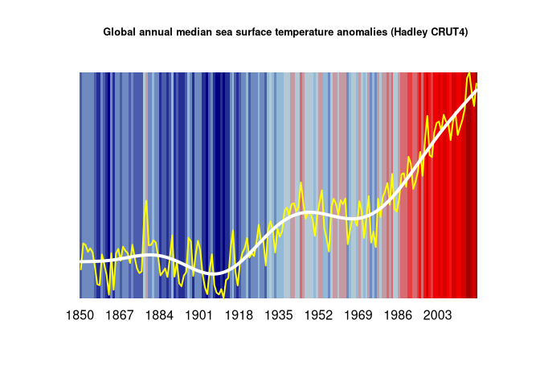
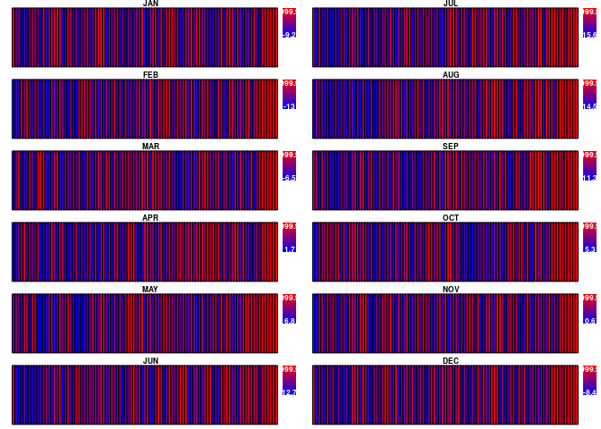

### What are Climate Stripes?

Climate stripes are visualisations of climate change from a temperature
time series (Climate Lab 2018). They are meant mostly as a communication
tool to a lay public and can be grasped almost instantly. They were
developed to have minimal annotation almost like a colour bar code.
Legend and time axis options have been included here if one wants to
convey a bit more information.

Installation
------------

    library(devtools)
    install_github("duplisea/climatestripes")

    library(climatestripes)

Make climate stripe plots for the Hadley CRUT4 sea surface temperature
----------------------------------------------------------------------

    time.vector= sst$year
    temperature.vector= sst$median
    title.name= "Global annual median sea surface temperature anomalies (Hadley CRUT4)"

    climate.col.stripes.f(time.vector= time.vector,temperature.vector=temperature.vector,
      colour.vec=c("navyblue","lightblue", "red","darkred"),
      title=title.name,
      legend=T,
      text.col.legend="yellow")

This clearly shows a warming particularly since the early 1980s.

This is quite similar to the climate lab’s three colour gradient but
they also tend to put white for average data.

From
<a href="https://www.climate-lab-book.ac.uk/2018/climate-stripes-for-the-uk/" class="uri">https://www.climate-lab-book.ac.uk/2018/climate-stripes-for-the-uk/</a>

You may want to code missing data as white though in which case that
could be deceptive take this plot from St Margaret’s Bay, NS, Canada for
example. There are missing data around 2012 which are coded white. In
the one below, “white” was added as the middle colour and different
points along the gradients were marked with particular colours and this
gives the light blues of the Climate Lab climate stripes. Experiment
with different gradients and you may find something that works better
for you. You could add as many colours as years even.

    climate.col.stripes.f(time.vector= time.vector,temperature.vector= temperature.vector,
      colour.vec=c("navyblue","lightblue","white","red","darkred"),
      title=title.name,
      legend=T,
      text.col.legend="yellow")

Make a climate stripe plot with data and a trendline superimposed
-----------------------------------------------------------------

It can be interesting to plot anomalies without a legend scale and
superimpose the data and trendline on it. This conveys more information
which can appeal to scientists without loosing the appeal of climate
stripes plots to the lay public. One has been constructed here that
looks like the climate lab climate stripes plots with data and gam
trendline superimposed.

    time.vector= sst$year
    temperature.vector= sst$median
    title.name= "Global annual median sea surface temperature anomalies (Hadley CRUT4)"

    climate.col.stripes.f(time.vector= time.vector,temperature.vector=temperature.vector,
      colour.vec=c("navyblue","lightblue", "red","darkred"),
      title=title.name,
      legend=F,
      text.col.legend="yellow")

    superimpose.data.f(time.vector=time.vector, temperature.vector=temperature.vector, data.colour="yellow", spline=T, spline.colour="white",lwd=4)

An annual climate stripe image with one plot for each month of the year
-----------------------------------------------------------------------

    months=c("JAN","FEB","MAR","APR","MAY","JUN","JUL","AUG","SEP","OCT","NOV","DEC")
    monthcols= match(months,names(stmargaretsbay))
    time.vector= stmargaretsbay$YEAR
    par(mfcol=c(6,2),mar=c(.2,.1,.5,.1))
    for (i in monthcols){
      temperature.vector= stmargaretsbay[,i]
      temperature.vector[temperature.vector==999.9]=NA
      climate.col.stripes.f(time.vector= time.vector,temperature.vector, colour.vec=c("navyblue","lightblue","red"),title=months[i-1], time.scale=F)
    }

The axis has been omitted to bring out the general pattern and
comparison between months. The legends give an idea of the actual
temperature each month.

References
==========

Climate Lab. 2018.
<a href="https://www.climate-lab-book.ac.uk/2018/warming-stripes/" class="uri">https://www.climate-lab-book.ac.uk/2018/warming-stripes/</a>

Enfield, D.B., A.M. Mestas-Nunez, and P.J. Trimble, 2001: The Atlantic
Multidecadal Oscillation and its relationship to rainfall and river
flows in the continental U.S., Geophys. Res. Lett., 28: 2077-2080.

GISTEMP Team, 2019: GISS Surface Temperature Analysis (GISTEMP), version
4. NASA Goddard Institute for Space Studies. Dataset accessed 2019-06-20
at
<a href="https://data.giss.nasa.gov/gistemp/" class="uri">https://data.giss.nasa.gov/gistemp/</a>.

Morice, C. P., J. J. Kennedy, N. A. Rayner, and P. D. Jones. 2011.
Quantifying uncertainties in global and regional temperature change
using an ensemble of observational estimates: The HadCRUT4 dataset, J.
Geophys. Res., 117, D08101,
<a href="doi:10.1029/2011JD017187" class="uri">doi:10.1029/2011JD017187</a>.
