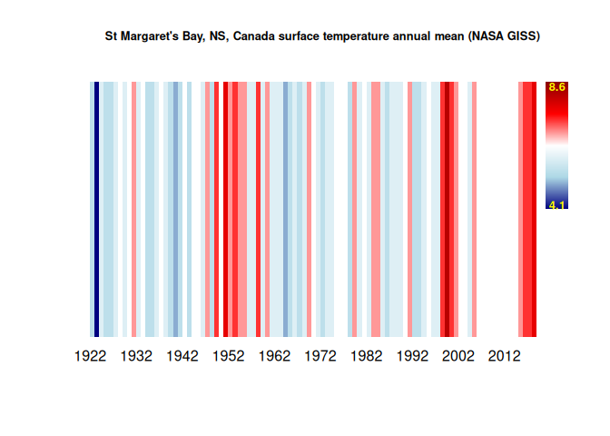
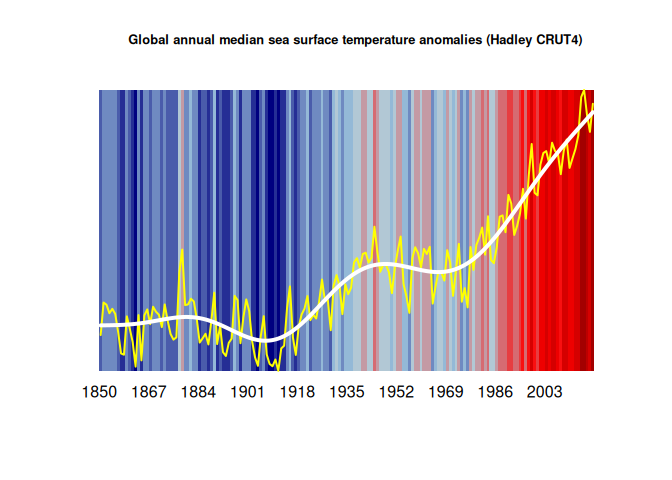
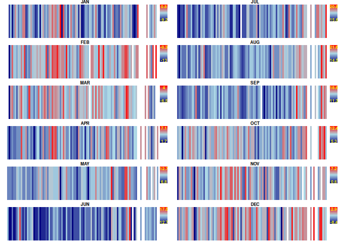
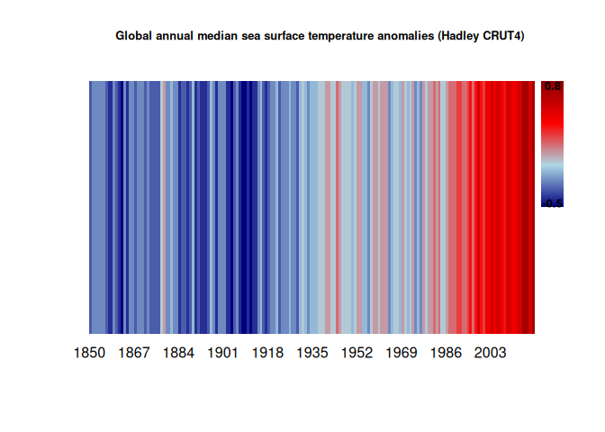
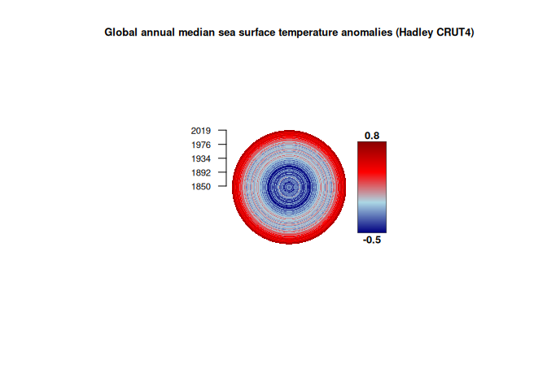
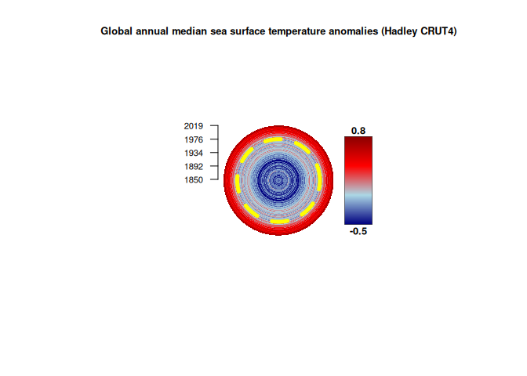

##### Updates

- First developed August 2019
- Updated in 2021
- Fixed break issues using Claude June 2026
- Unlikely to be updated given availability of these graphs in other
  packages and the ease of making them via AI and ggplot

### What are Climate Stripes?

Climate stripes are visualisations of climate change from a temperature
time series (Climate Lab 2018). They are meant mostly as a communication
tool to a lay public and can be grasped almost instantly. They were
developed to have minimal annotation almost like a colour bar code.
Legend and time axis options have been included here if one wants to
convey a bit more information.

## Installation

    library(devtools)
    install_github("duplisea/climatestripes")

    library(climatestripes)

## Make climate stripe plots for the Hadley CRUT4 sea surface temperature

    time.vector= sst$year
    temperature.vector= sst$median
    title.name= "Global annual median sea surface temperature anomalies (Hadley CRUT4)"

    climate.col.stripes.f(time.vector= time.vector,temperature.vector=temperature.vector,
      colour.vec=c("navyblue","lightblue", "red","darkred"),
      title=title.name,
      legend=T,
      text.col.legend="yellow", n.categories.legend=200)

This clearly shows a warming particularly since the early 1980s.

This is quite similar to the climate lab’s three colour gradient but
their gradient theoretically makes average data white.

From
<https://www.climate-lab-book.ac.uk/2018/climate-stripes-for-the-uk/>

You may want to code missing data as white though in which case that
could be deceptive take this plot from St Margaret’s Bay, NS, Canada for
example. There are missing data around 2012 which are coded white and
they may appear as average at quick glance. Of course you could use
another distinctive colour for missing data. Experiment with different
gradients and you may find something that works better for you. You
could add as many colours as years even.

    time.vector= stmargaretsbay$YEAR
    temperature.vector= stmargaretsbay$metANN
    temperature.vector[temperature.vector==999.9]=NA
    climate.col.stripes.f(time.vector= time.vector,temperature.vector= temperature.vector,
      colour.vec=c("navyblue","lightblue","white","red","darkred"),
      title="St Margaret's Bay, NS, Canada surface temperature annual mean (NASA GISS)",
      legend=T,
      text.col.legend="yellow")

## Make a climate stripe plot with data and a trendline superimposed

It can be interesting to plot anomalies without a legend scale and
superimpose the data and trendline on it. This conveys more information
which can appeal to scientists without loosing the appeal of climate
stripes plots to the lay public. One has been constructed here that
looks like the climate lab climate stripes plots with data and gam
trendline superimposed.

    time.vector= sst$year
    temperature.vector= sst$median
    title.name= "Global annual median sea surface temperature anomalies (Hadley CRUT4)"

    climate.col.stripes.f(time.vector= time.vector,temperature.vector=temperature.vector,
      colour.vec=c("navyblue","lightblue", "red","darkred"),
      title=title.name,
      legend=F,
      text.col.legend="yellow")

    superimpose.data.f(time.vector=time.vector, temperature.vector=temperature.vector, data.colour="yellow", spline=T, spline.colour="white",lwd=4)

## An annual climate stripe image with one plot for each month of the year

    months=c("JAN","FEB","MAR","APR","MAY","JUN","JUL","AUG","SEP","OCT","NOV","DEC")
    monthcols= match(months,names(stmargaretsbay))
    time.vector= stmargaretsbay$YEAR
    par(mfcol=c(6,2),mar=c(.2,.1,.5,.1))
    for (i in monthcols){
      temperature.vector= stmargaretsbay[,i]
      temperature.vector[temperature.vector==999.9]=NA
      climate.col.stripes.f(time.vector= time.vector,temperature.vector, colour.vec=c("navyblue","lightblue","red"),title=months[i-1], time.scale=F)
    }

The axis has been omitted to bring out the general pattern and
comparison between months. The legends give an idea of the actual
temperature each month.

You can pull the latest global surface temperature data directly from
the NASA GISS website using the very powerful <b>fread</b> function from
data.table and the correct URL

    GISTEMP= as.data.frame(fread("https://data.giss.nasa.gov/gistemp/tabledata_v4/GLB.Ts+dSST.csv", na.strings="***"))
    time.vector= GISTEMP$Year
    monthcols= 2:13
    months= names(GISTEMP)[monthcols]
    par(mfcol=c(6,2),mar=c(.2,.1,.5,.1))
    for (i in monthcols){
      temperature.vector= GISTEMP[,i]
      climate.col.stripes.f(time.vector= time.vector,temperature.vector,
        colour.vec=c("navyblue","lightblue","red"),title=months[i-1], time.scale=F)
      superimpose.data.f(time.vector=time.vector, temperature.vector=temperature.vector, 
        data.colour="yellow", spline=T, spline.colour="white",lwd=2)
    }

## Climate rings

Climate rings show the same information as climate stripes but in a
circular form, resembling tree rings. The most recent year is the
outermost ring and the oldest year is at the centre, so the progression
from cool (old) to warm (recent) reads naturally from inside to outside.
To ensure the rings and a companion stripes plot share identical colour
mapping, capture the colours returned invisibly by
`climate.col.stripes.f` and pass them to `stripe.cols`.

    time.vector <- sst$year
    temperature.vector <- sst$median
    title.name <- "Global annual median sea surface temperature anomalies (Hadley CRUT4)"

    # draw the stripes plot and capture the colours
    stripe.cols <- climate.col.stripes.f(
      time.vector = time.vector,
      temperature.vector = temperature.vector,
      colour.vec = c("navyblue", "lightblue", "red", "darkred"),
      title = title.name,
      legend = TRUE,
      text.col.legend = "black"
    )

    # draw the rings plot reusing the same colour mapping
    # most recent year is outermost, oldest year is at the centre
    climate.col.rings.f(
      time.vector = time.vector,
      temperature.vector = temperature.vector,
      stripe.cols = stripe.cols,
      colour.vec = c("navyblue", "lightblue", "red", "darkred"),
      title = title.name,
      legend = TRUE,
      text.col.legend = "black"
    )

## Climate rings with a breakpoint

A segmented (piecewise) linear regression can be fitted to the
temperature series and the estimated breakpoint year superimposed on the
rings plot as a dashed circle. This can highlight a structural change in
the trend such as an acceleration of warming, for example the
well-documented shift in global sea surface temperatures in the late
1970s. The breakpoint year is also printed to the console.

    time.vector <- sst$year
    temperature.vector <- sst$median
    title.name <- "Global annual median sea surface temperature anomalies (Hadley CRUT4)"

    # rings plot standalone, no companion stripes plot needed
    climate.col.rings.f(
      time.vector = time.vector,
      temperature.vector = temperature.vector,
      colour.vec = c("navyblue", "lightblue", "red", "darkred"),
      title = title.name,
      legend = TRUE,
      text.col.legend = "black"
    )

    # superimpose a dashed circle at the estimated structural breakpoint year
    rings.breakpoint.f(
      time.vector = time.vector,
      temperature.vector = temperature.vector,
      border.colour = "yellow",
      lty = 2,
      lwd = 5
    )

    ## Estimated breakpoint year: 1976

# References

Climate Lab. 2018.
<https://www.climate-lab-book.ac.uk/2018/warming-stripes/>

Enfield, D.B., A.M. Mestas-Nunez, and P.J. Trimble, 2001: The Atlantic
Multidecadal Oscillation and its relationship to rainfall and river
flows in the continental U.S., Geophys. Res. Lett., 28: 2077-2080.

ESRL data from NOAA.
<https://www.esrl.noaa.gov/psd/gcos_wgsp/Timeseries/>

GISTEMP Team, 2019: GISS Surface Temperature Analysis (GISTEMP), version
4. NASA Goddard Institute for Space Studies. Dataset accessed 2019-06-20
at <https://data.giss.nasa.gov/gistemp/>.

Morice, C. P., J. J. Kennedy, N. A. Rayner, and P. D. Jones. 2011.
Quantifying uncertainties in global and regional temperature change
using an ensemble of observational estimates: The HadCRUT4 dataset, J.
Geophys. Res., 117, D08101, <doi:10.1029/2011JD017187>.

# Citation

Duplisea, D.E. 2019. An R package for making climate stripe plots.
<https://github.com/duplisea/climatestripes>
